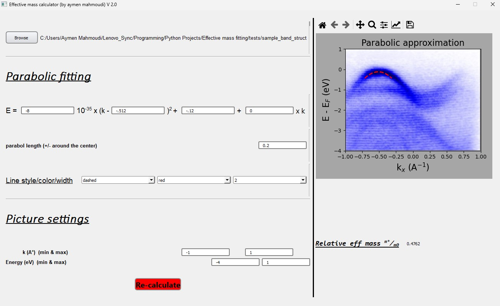

# Effective mass fitting


## Description
This project allows the estimation of the effective mass of an electronic band by fitting this latter with a parabolic shape.
<br>  
For the bands near the Fermi level, the dispersion relation can be considered as :

$$\frac{1}{2m^{*}} = \frac{1}{\hbar^{2}} \frac{\mathrm{d} E }{\mathrm{d} k^{2}}$$

$\alpha_{R}$ is the Rashba parameter

$$E(k)=\frac{\hbar^{2}}{2m^{*}}k^{2}\pm \alpha_{R}k$$

$$E(k) \propto c\times k^{2}$$

Knowing the concavity of the parabola, the effective mass can be calculated via : 
$$m^{*} = \frac{\hbar^{2}}{2c}$$


## Usage
You need to provide an image with the ARPES 2D scan to be opened via the browsing buton. Then, you can fit the parabola with the wanted band. The effective mass value is updating via the update buton.




## Installation
To use the app, you can download and directly execute the file mass.exe (just for Windows X64). Otherwise, you can run the main.py script which is available within the necessary resources. I recommend to setup a python 3.8 virtual environment and adding the required libraries using the following command after cloning the rep (you can just download the rep in case you don't use git):
```console
pip install -r requirements.txt
```

## Roadmap
 <ul>
  <li>Avoid the crash of the app in case of empty value</li>
  <li>Transform the project on a desktop application</li>
</ul> 

## Support and Contributing
Let me know if you have any suggestions/ideas to enhance those scripts or add further settings. Your suggestions are warmly welcomed.
<br>
In case of a problem, It is strongly recommended to post an issue. For a more confidential demand, don't hesitate to email me.

## Acknowledgment
I thank Geoffroy Kremer for testing and verifying the formula.  


